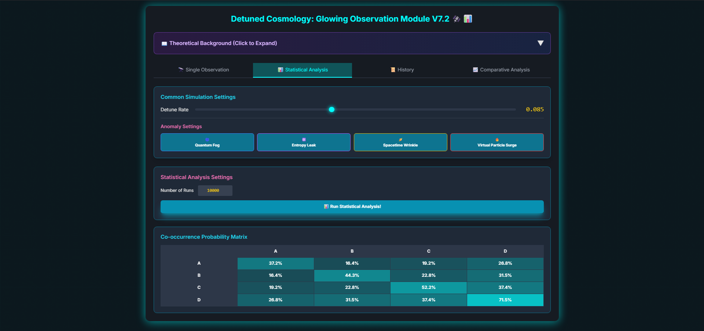
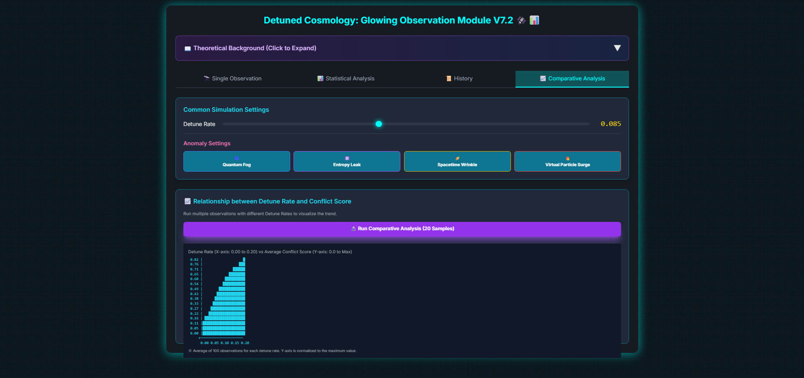
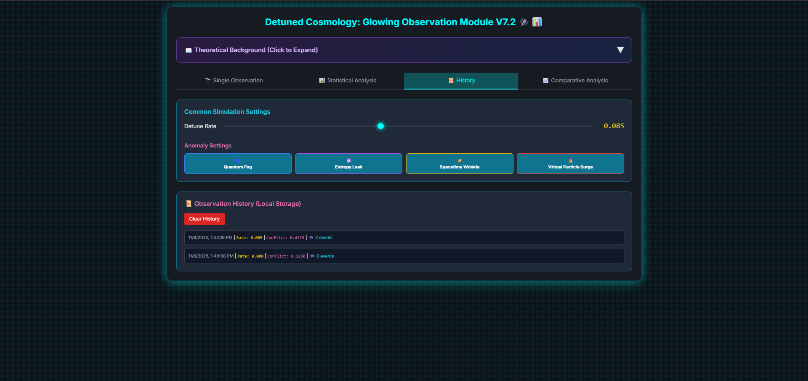

# Detune Universe Observer v7.2 🛰️📊

> **A thought experiment in HTML**  
> What if the laws of physics are just *cost-cutting measures* in a resource-constrained simulation?

This interactive dashboard lets you **tune the "detuning rate"** — the degree to which the simulation deviates from perfect physics — and observe the resulting **anomalies**, **conflicts**, and **instabilities**.

---

## 🌌 [Live Demo](https://snowbellsan.github.io/detune-universe-observer)

> Just open `index.html` in any browser.  
> No install. No server. No tracking. No escape.

---

## Features

| Feature | Description |
|-------|-------------|
| **Detune Rate Slider** | 0.00 → 0.20: Introduce controlled deviation from ideal physics |
| **Anomaly Detection** | Quantum Fog, Entropy Leak, Spacetime Wrinkles, Virtual Particle Overflow |
| **Live Conflict Index** | Real-time stability scoring of the simulated cosmos |
| **Statistical Co-occurrence Matrix** | Heatmap of anomaly correlations |
| **Historical Logging** | LocalStorage-backed observation records (last 50) |
| **Comparative Analysis** | ASCII chart: Detuning vs. average contradiction |

> **100% fiction. 0% science. 100% existential wonder.**

---

## Screenshots

| Single Observation | Statistical Analysis |
|--------------------|------------------------|
|  |  |

| Comparison Chart | History Log |
|------------------|-------------|
|  |  |

---

## How to Use

1. **Clone or download** this repo
2. Open `index.html` in your browser
3. **Slide the Detune Rate**
4. Click **"Single Observation"**
5. Watch the universe **glitch**

> **Warning**: High detune rates may cause unease. The simulation *might* be watching.

---

## The Anomalies

| ID | Name | Icon | Base Probability | Sensitivity |
|----|------|------|------------------|-------------|
| A | Quantum Fog | Cyclone | 20% | 2.0 |
| B | Entropy Leak | Atom | 15% | 3.5 |
| C | Spacetime Wrinkle | Ringed Planet | 10% | 5.0 |
| D | Virtual Particle Overflow | Fire | 5% | 8.0 |

> Toggle them on/off to simulate different optimization strategies.

---

## Philosophy

> *"Perfect physics is expensive. Glitches are free."*  
> — *Unknown Simulator Engineer*

This is not science.  
This is **speculative archaeology** — digging for the fingerprints of a budget-conscious creator.

---

## Tech Stack

- HTML5
- Tailwind CSS (via CDN)
- Vanilla JavaScript
- LocalStorage
- Pure romantic speculation

---

## Local Development

```bash
# Just open index.html
open index.html
